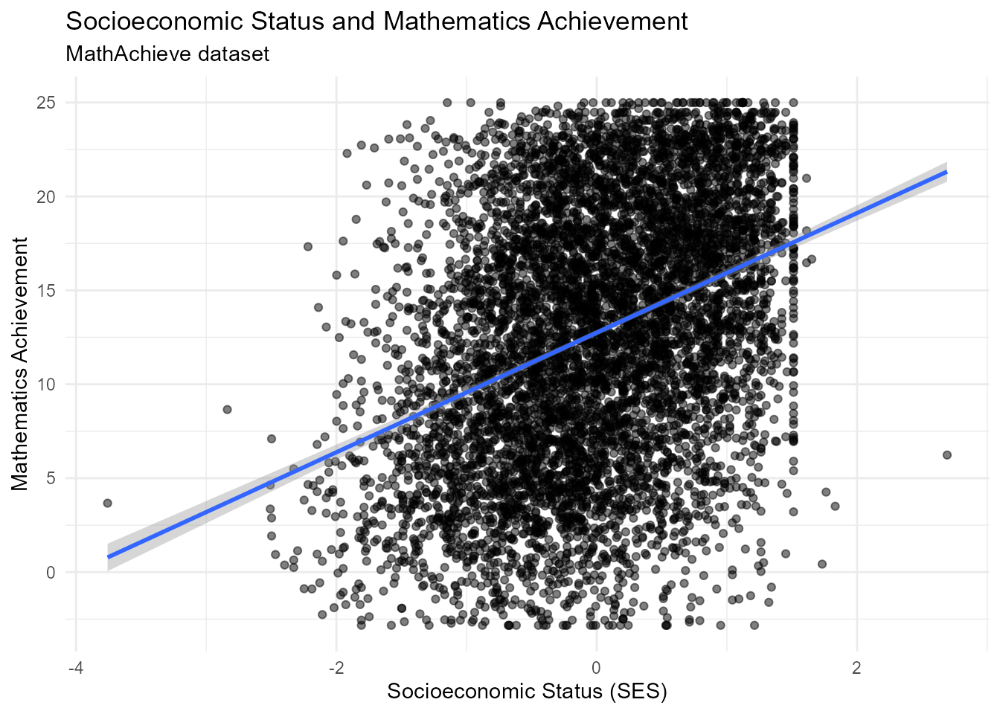

# intro-eduResearchR

``` r

library(eduResearchR)
library(dplyr)
#> 
#> Attaching package: 'dplyr'
#> The following objects are masked from 'package:stats':
#> 
#>     filter, lag
#> The following objects are masked from 'package:base':
#> 
#>     intersect, setdiff, setequal, union
library(ggplot2)
library(knitr)
```

## Overview

`eduResearchR` is a curated collection of educational datasets designed
to support empirical research, quantitative data analysis, statistical
modeling, data visualization, and teaching in the field of education.

The package brings together datasets covering different dimensions of
educational research, including student performance, schools,
classrooms, teachers, educational trajectories, higher education,
educational assessment, and international education.

## Getting Started

To begin using `eduResearchR`, load the package and access any of its
included datasets.

For example, the following code loads and displays the first five
observations of the `STARplus` dataset:

``` r

data("STARplus")
head(STARplus, 5)
#>   stdntid gender  race birthmonth birthday birthyear read_yr1 math_yr1
#> 1   10000   male white          1       22      1979      516      578
#> 2   10001   male white          2       20      1980       NA       NA
#> 3   10002 female black          7       21      1979      577      570
#> 4   10003   male white          5       28      1980      451      507
#> 5   10004 female black          1        2      1980      579      584
#>   gktreadss gktmathss gktlistss gkwordskillss g1schid  g1tchid g1classsize
#> 1        NA        NA        NA            NA  170295 17029507          23
#> 2        NA        NA        NA            NA      NA       NA          NA
#> 3        NA        NA        NA            NA      NA       NA          NA
#> 4        NA        NA        NA            NA  257899 25789906          22
#> 5        NA        NA        NA            NA      NA       NA          NA
#>   g1treadss g1tmathss g1tlistss g1wordskillss g1readbsraw g1mathbsraw
#> 1       516       578       601           493          25          43
#> 2        NA        NA        NA            NA          NA          NA
#> 3        NA        NA        NA            NA          NA          NA
#> 4       451       507       584           436          20          42
#> 5        NA        NA        NA            NA          NA          NA
#>   g1readbsobjpct g1mathbsobjpct g2schid  g2tchid g2classsize g2treadss
#> 1             75            100  170295 17029510          23       547
#> 2             NA             NA      NA       NA          NA        NA
#> 3             NA             NA      NA       NA          NA        NA
#> 4             50            100  257899 25789915          22       562
#> 5             NA             NA  244796 24479610          19       579
#>   g2tmathss g2tlistss g2wordskillss g2readbsraw g2mathbsraw g2readbsobjpct
#> 1       577       572           547          32          56             93
#> 2        NA        NA            NA          NA          NA             NA
#> 3        NA        NA            NA          NA          NA             NA
#> 4       563       581           593          44          43             72
#> 5       584       572           560          40          59             98
#>   g3schid  g3tchid g3classsize g3treadss g3tmathss g3tlangss g3tlistss
#> 1  170295 17029514          26       583       586       606       584
#> 2      NA       NA          NA        NA        NA        NA        NA
#> 3  205492 20549213          23       577       570       600       603
#> 4  257899 25789916          21       614       614       606       652
#> 5  244796 24479613          28       616       624       627       597
#>   g3socialsciss g3spellss g3vocabss g3mathcomputss g3mathnumconcss g3mathapplss
#> 1           613       591       585            570             588          602
#> 2            NA        NA        NA             NA              NA           NA
#> 3           559       576       580            562             567          579
#> 4           632       581       651            619             588          632
#> 5           609       645       576            637             620          613
#>   g3wordskillss g3readbsraw g3mathbsraw g3readbsobjpct g3mathbsobjpct
#> 1           584          28          45             80             80
#> 2            NA          NA          NA             NA             NA
#> 3           581          22          45             30             73
#> 4           591          30          55             80             93
#> 5           584          37          54            100            100
#>          dob dobNA grade_at_entry school_at_entry cond_at_entry
#> 1 1979-01-22 FALSE              1          170295  regular+aide
#> 2 1980-02-20 FALSE              k          169229  regular+aide
#> 3 1979-07-21 FALSE              3          205492  regular+aide
#> 4 1980-05-28 FALSE              1          257899       regular
#> 5 1980-01-02 FALSE              2          244796  regular+aide
```

## Available Datasets

The first version of `eduResearchR` includes 15 curated educational
datasets organized into six major areas of research.

### Students and Performance

1.  **`STARplus`** — Student performance, demographic characteristics,
    grade, school, classroom type, and longitudinal information.

2.  **`MathAchieve`** — Student characteristics, socioeconomic status,
    school, and mathematics achievement.

### School, Classroom and Teachers

3.  **`classroom`** — Mathematics achievement, socioeconomic status,
    teacher experience, and teacher mathematical knowledge.

4.  **`schools`** — Student and school characteristics, socioeconomic
    status, and mathematics achievement.

5.  **`apipop`** — Student performance and institutional characteristics
    of California schools.

6.  **`CASchools`** — School performance, teachers, expenditures,
    income, English learners, and reading and mathematics outcomes.

### Educational Trajectory

7.  **`NELS`** — Longitudinal information about students, families,
    schools, motivation, aspirations, absenteeism, and academic
    achievement.

8.  **`schoolProgram`** — Student characteristics, socioeconomic status,
    school type, educational program, and academic performance.

### Higher Education

9.  **`CollegeDistance`** — Educational attainment and factors such as
    parental education, income, distance to college, and tuition.

10. **`school`** — Institutional characteristics, enrollment, costs,
    student aid, and outcomes of higher education institutions.

11. **`STUDENT`** — College GPA and academic and personal
    characteristics of university students.

12. **`FirstYearGPA`** — First-year college GPA and characteristics
    related to the transition from secondary to higher education.

### Educational Assessment

13. **`ExamScores`** — Student and school characteristics and
    examination results, suitable for educational and multilevel
    analysis.

### International Education

14. **`pisausa`** — PISA 2009 data for U.S. students, including
    academic, family, and school characteristics.

15. **`EducationLiteracy`** — International information on education and
    literacy.

## Exploring a Dataset

To illustrate how `eduResearchR` can be used for quantitative
educational research, we will work with the `MathAchieve` dataset.

This dataset contains information related to mathematics achievement,
socioeconomic status, student characteristics, and schools.

``` r

data("MathAchieve")
head(MathAchieve, 5)
#>   School Minority    Sex    SES MathAch MEANSES
#> 1   1224       No Female -1.528   5.876  -0.428
#> 2   1224       No Female -0.588  19.708  -0.428
#> 3   1224       No   Male -0.528  20.349  -0.428
#> 4   1224       No   Male -0.668   8.781  -0.428
#> 5   1224       No   Male -0.158  17.898  -0.428
```

### Variables in `MathAchieve`

The `MathAchieve` dataset contains the following variables:

``` r

variables <- data.frame(
  Variable = names(MathAchieve)
)

knitr::kable(
  variables,
  caption = "Variables included in the MathAchieve dataset"
)
```

| Variable |
|:---------|
| School   |
| Minority |
| Sex      |
| SES      |
| MathAch  |
| MEANSES  |

Variables included in the MathAchieve dataset {.table}

The main variables included in the dataset are:

- `School`: school identifier.
- `Minority`: minority status of the student.
- `Sex`: sex of the student.
- `SES`: socioeconomic status of the student.
- `MathAch`: mathematics achievement score.
- `MEANSES`: mean socioeconomic status of the school.

## Visualization

One possible research question using `MathAchieve` is:

> **Is there a relationship between students’ socioeconomic status and
> their mathematics achievement?**

The following graph visualizes the relationship between `SES` and
`MathAch`:

``` r

ggplot(MathAchieve, aes(x = SES, y = MathAch)) +
  geom_point(alpha = 0.5) +
  geom_smooth(method = "lm", se = TRUE) +
  labs(
    title = "Socioeconomic Status and Mathematics Achievement",
    subtitle = "MathAchieve dataset",
    x = "Socioeconomic Status (SES)",
    y = "Mathematics Achievement"
  ) +
  theme_minimal()
#> `geom_smooth()` using formula = 'y ~ x'
```



The graph allows researchers to visually examine whether differences in
socioeconomic status are associated with differences in mathematics
achievement.

## Conclusion

`eduResearchR` provides a curated collection of 15 educational datasets
that can be used to explore different research questions involving
students, classrooms, teachers, schools, educational trajectories,
higher education, educational assessment, and international education.

By bringing these datasets together in a single R package,
`eduResearchR` facilitates access to educational data for statistical
analysis, data visualization, teaching, empirical research, and
quantitative educational studies.

The package therefore provides a practical starting point for
researchers and students who want to move from educational questions to
evidence-based analysis using R.
